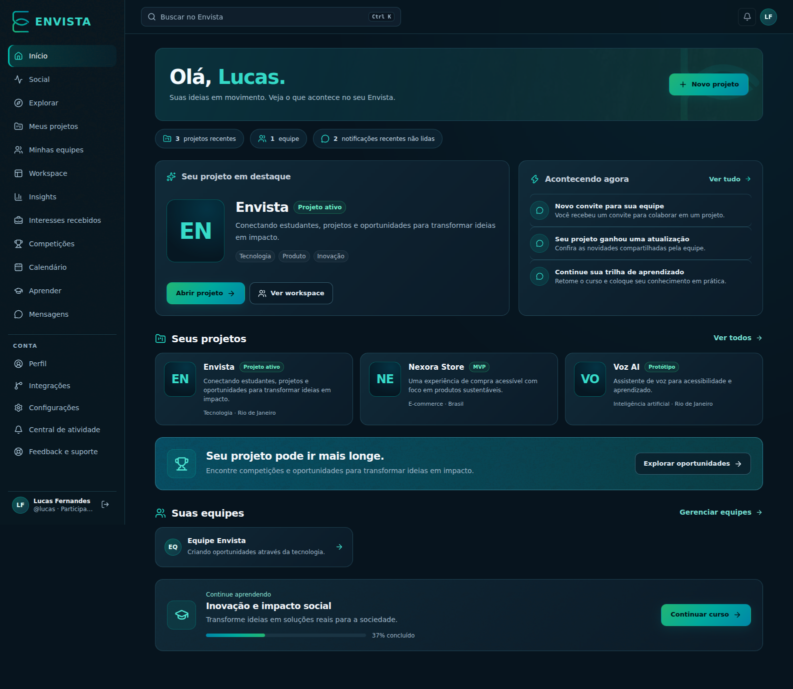
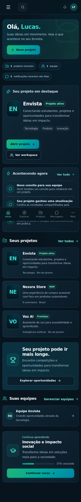

# Redesign Envista — outubro de 2026

A aplicação autenticada passa a usar a mesma navegação em todas as abas. A home reúne projeto em destaque, atividade, projetos, equipes e aprendizado, usando os dados já consultados pelo servidor. Não há migração, novos dados demonstrativos em produção ou alterações de autorização.

## Direção visual

- Paleta oficial: azul `#0086a7`, teal `#00a99d`, verde `#22b573` e tinta `#0f1923`.
- Canvas escuro, superfícies com contraste, bordas ciano, cabeçalhos com textura original e símbolo da marca.
- Ações principais com gradiente; ações secundárias com contorno; exclusão conserva o tratamento destrutivo.
- Tokens compartilhados entre Social, projetos, equipes, Workspace, Insights, interesses, competições, calendário, cursos, mensagens, notificações, GitHub, conta e administração.
- Menu móvel com foco inicial, ciclo de Tab, Escape e retorno ao botão de abertura. Conteúdo respeita `prefers-reduced-motion`.

## Capturas de referência

As capturas abaixo usam os componentes de produção com **dados de exemplo locais** para revisão visual. Os dados de exemplo e a rota temporária de inspeção não fazem parte da aplicação publicada. A home real mantém suas consultas existentes, inclusive estados vazios e progresso real de cursos; não inventa percentuais de projetos ou oportunidades.

## Validação

- Build de produção, TypeScript e suíte Vitest.
- Inspeção local via Chromium de oito composições em cinco larguras: 1586, 980, 768, 390 e 320 pixels; sem overflow horizontal do documento ou erros de JavaScript.
- Menu móvel: abertura, foco inicial, Tab/Shift+Tab e Escape.
- Busca global: abertura via Ctrl+K e fechamento via Escape.
- Estilos calculados confirmam diferença entre ação principal preenchida e ação secundária contornada.
- Home também revisada com conta vazia.

**Limite:** sem credenciais de uma conta de teste, os fluxos autenticados com dados reais (publicar, conversar, vincular GitHub, editar perfil e tarefas) precisam de smoke test no preview conectado ao ambiente antes do merge. A revisão local não comprova esses fluxos fim a fim.
