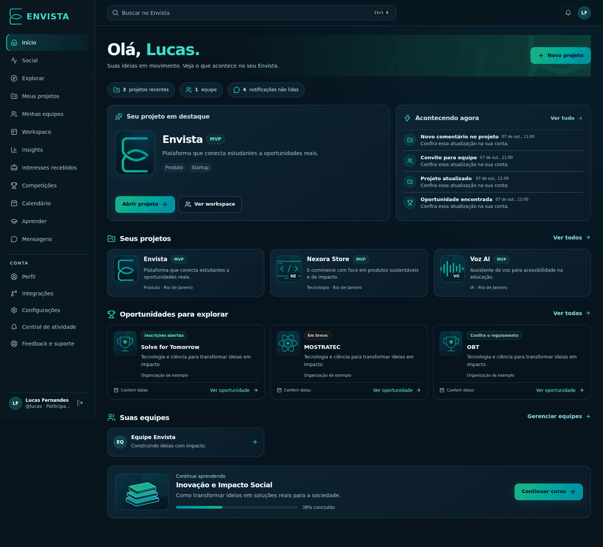

# Redesign Envista — outubro de 2026

A aplicação autenticada passa a usar a mesma navegação em todas as abas. A home reúne projeto em destaque, atividade, projetos, equipes e aprendizado, usando os dados já consultados pelo servidor. Não há migração, novos dados demonstrativos em produção ou alterações de autorização.

## Direção visual

- Paleta oficial: azul `#0086a7`, teal `#00a99d`, verde `#22b573` e tinta `#0f1923`.
- Canvas escuro, superfícies com contraste, bordas ciano, cabeçalhos com textura original e símbolo da marca.
- Ações principais com gradiente; ações secundárias com contorno; exclusão conserva o tratamento destrutivo.
- Tokens compartilhados entre Social, projetos, equipes, Workspace, Insights, interesses, competições, calendário, cursos, mensagens, notificações, GitHub, conta e administração.
- Menu móvel com foco inicial, ciclo de Tab, Escape e retorno ao botão de abertura. Conteúdo respeita `prefers-reduced-motion`.

## Capturas de referência

As capturas abaixo usam os componentes de produção com **dados de exemplo locais** para revisão visual. Os dados de exemplo e a rota temporária de inspeção não fazem parte da aplicação publicada. A home real mantém suas consultas existentes e consulta a API já existente de competições, inclusive estados vazios e progresso real de cursos; não inventa percentuais de projetos ou oportunidades.

## Validação

- Build de produção, TypeScript e suíte Vitest.
- Inspeção local via Chromium de oito composições em cinco larguras: 1586, 980, 768, 390 e 320 pixels; sem overflow horizontal do documento ou erros de JavaScript.
- Menu móvel: abertura, foco inicial, Tab/Shift+Tab e Escape.
- Busca global: abertura via Ctrl+K e fechamento via Escape.
- Estilos calculados confirmam diferença entre ação principal preenchida e ação secundária contornada.
- Home também revisada com conta vazia.

**Limite:** sem credenciais de uma conta de teste, os fluxos autenticados com dados reais (publicar, conversar, vincular GitHub, editar perfil e tarefas) não foram testados de ponta a ponta nesta revisão. A revisão local não comprova esses fluxos fim a fim.

## Refinamento com imagens

- Artes SVG locais e leves: desenvolvimento, impacto social, voz, ciência, competições e livros. Os projetos usam uma arte por tema com suas iniciais; o projeto Envista usa o símbolo oficial. As artes são ilustrativas, não logotipos oficiais de competições.
- A home exibe até três oportunidades não encerradas pela API existente, preservando o estado real de inscrições e uma saída útil para carregamento, vazio e falha.
- A mesma linguagem de imagens aparece nas listas de projetos e competições. Sem dependências, imagens externas ou migrações adicionais.
- Refinamento inspecionado em 1586, 980, 768, 390 e 320px: sem overflow horizontal, imagens carregadas e sem erros JS. Estados vazio e erro da API também verificados.

## Pesquisa e regras consolidadas

A revisão de composição e densidade foi baseada em fontes primárias de Linear, Atlassian e GitHub/Primer. Diagnóstico, decisões e contrato visual estão em [design-rules.md](./design-rules.md).

Capturas adicionais com componentes reais e dados de exemplo:

- [Projetos desktop](./projects-desktop.svg) / [celular](./projects-mobile.svg)
- [Competições desktop](./competitions-desktop.svg) / [celular](./competitions-mobile.svg)
- [GitHub desktop](./github-desktop.svg) / [celular](./github-mobile.svg)

A revisão de regras passou por 20 combinações (4 telas × 5 larguras), com imagens carregadas, sem overflow horizontal do documento e sem erros de JavaScript. As capturas de celular de competições e GitHub foram refinadas após detectar texto cortado e excesso de altura no cabeçalho.

## Cobertura final

O padrão foi ampliado para as demais famílias de páginas. Veja [page-coverage.md](./page-coverage.md) para escopo e verificação. A auditoria do CI exigiu também correções compatíveis no lockfile: `sharp` 0.35.5 e `source-map-js` 1.2.2, sem nova dependência direta.
